# Table des matières
1. [Introduction](#introduction)
   1. [Objectifs de la veille technologique](#objectifs-de-la-veille-technologique)
   1. [Cadre de la veille technologique](#cadre-de-la-veille-technologique)
1. [Présentation de JavaScript](#présentation-de-javascript)
   1. [Un langage très populaire du fait de sa polyvalence](#un-langage-très-populaire)
   1. [Hello World!](#hello-world)
1. [Les API Javascript pour accéder au matériel](#les-api-javascript-pour-accéder-au-matériel)
   1. [API de géolocalisation](#api-de-géolocalisation)
   1. [API d'orientation et de mouvement](#api-dorientation-et-de-mouvement)
   1. [API de vibration](#api-de-vibration)
   1. [API Battery Status](#api-battery-status)
   1. [API de lumière ambiante](#api-de-lumière-ambiante)
   1. [API d'évènements de proximité](#api-dévènements-de-proximité)
   1. [API de capture média](#api-de-capture-média)

# Introduction

## Objectifs de la veille technologique

L'objectif de ce document est de mettre en lumière les diverses API Javascript permettant d'accéder au matériel depuis un navigateur sur des dispositifs mobiles comme les smartphones ou tablettes, de prendre conscience de leur potentiel et de les illustrer par des exemples d'applications.

## Cadre de la veille technologique

HTML5, dernière version majeure de HTML, est sorti en octobre 2014 avec de nombreuses nouvelles API. Comme nouveautés, nous pouvons lister entre autre :
* une API de dessin 2D utilisée avec la nouvelle balise `canvas`,
* une API pour jouer des vidéos et des sons/musiques utilisée avec les nouvelles balises `video` et `audio`,
* l'intégration d' API tierces telles que WebGL du Khronos Group permettant d'ajouter aux pages du contenu 3D.

Une API, ou Application Programming Interface, peut être définie comme étant une *façade* par laquelle un logiciel donne accès à son potentiel à d’autres logiciels. Cela peut être : donner accès à des données, à des logiciels, des processus etc...

JavaScript, créé en 1995 par Brendan Eich, est le "langage du Web" (on dit d'ailleurs que "HTML5 = HTML5 + CSS3 + JS"). Il s'agit d'un langage de script orienté objet. Il est principalement utilisé dans le but d'améliorer l'ergonomie d'une page web et/ou d'une UI, de dynamiser une page Web, d'interagir avec le HTML. Le navigateur web prend en charge l'exécution de ces scripts.

# Présentation de JavaScript

Afin de bien cerner les enjeux de la veille et du tour d'horizon sur les API JavaScript qui suivra, faisons une rapide présentation du langage concerné ici.

## Un langage très populaire du fait de sa polyvalence

JavaScript est le langage le plus populaire au monde, comme le montre le graphique suivant :

<table align="center" border="0">
  <tr>
    <td>
      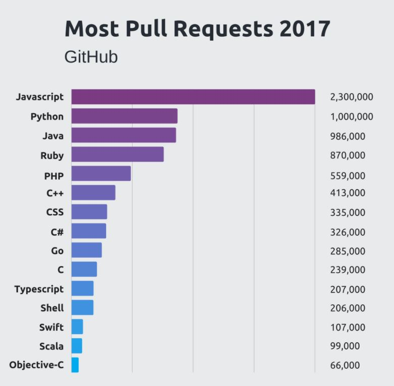
    </td>
  </tr>
  <tr>
    <td align="center" bgcolor="EFEFEF">
      Nombre de <i>pull requests</i> sur GitHub par langages en 2017
    </td>
  </tr>
</table>

En effet, le nombre de pull requests concernés par des scripts JavaScript est largement plus élévé que pour les autres langages en 2017.
JavaScript est très populaire grâce au fait qu'il reste encore de nos jours le langage du Web, malgré l'émergence d'autres langages. De plus, sa popularité a été amplifiée grâce à la création de [node.js](https://nodejs.org/en/) permettant l'utilisation JavaScript côté serveur. La simplicité et la vitesse de node.js lui a permis d'être utilisé par bon nombre de start-up par exemple.

Ainsi, JavaScript est un langage complet, utilisé autant côté client (front-end, côté navigateur, avec des frameworks tels qu'[Angular](https://angular.io/) ou côté application mobile avec [Cordova](https://cordova.apache.org/)) que côté serveur comme nous l'avons mentionné plus haut.

## Hello World!

Afin d'illustrer la notion d'API JavaScript, regardons l'exemple d'un "Hello World!" dans ce langage.
La façon classique de faire un "Hello World!" en JavaScript est en utilsant un `alert` dans une balise `script` d'un document HTML :

```html
<!DOCTYPE HTML>
<html>

<body>

  <script>
    alert( 'Hello, world!' );
  </script>

</body>

</html>
```

En lançant le document dans un navigateur, une popup nous indique "Hello, world!".

Nous allons voir une autre approche. Nous allons modifier le DOM, en utilisant l'API JavaScript permettant de le manipuler.

```html
<!DOCTYPE HTML>
<html>

<body>

  <div id="display"></div>

  <script>
    document.getElementById('display').innerHTML = 'Hello World!'
  </script>

</body>

</html>
```

Ici, le "Hello World!" n'apparaitra pas dans une popup comme précedemment mais sur la page elle-même. Ici, grâce à l'API JavaScript permettant de manipuler le DOM, on accède à l'élément HTML ayant pour `id` "display", puis on déclare sa valeur interne (`innerHTML`). Nous verrons plus tard que l'objet `document` sera encore utilisé et qu'il donne accès à d'autres API.

# Les API Javascript pour accéder au matériel

Maintenant que nous avons succinctement présenté le langage JavaScript, faisons à présent un tour d'horizon des API JavaScript permettant d'accéder au matériel des dispositifs mobiles depuis un navigateur Web tel que Chrome Android, iOS Safari etc...

## API de géolocalisation

#### Principe

Cette API donne des informations à propos de la position de l’utilisateur. L'objet `document.geolocation` a une fonction `getCurrentPosition` permettant d'accéder aux données relatives à la position de l'utilisateur grâce au GPS du smartphone ou tablette. On accède ainsi au matériel du dispositif. Dans le cas de la géolocalisation, il est néanmoins possible d'avoir la position de l'utilisateur sans passer par le GPS : s'il est connecté en Wi-Fi, on peut accéder à la position du *hotspot*. Voici un exemple d'utilisation de la fonction `getCurrentPosition` :

```html
// Récupérons la localisation.
navigator.geolocation.getCurrentPosition(function(position) {
    // Récupérons les coordonnées associée à la localisation actuelle de l'utilisateur.
    var lat = position.coords.latitude;
    var lon = position.coords.longitude;

    // Une action intéressante ...
});
```

Le *callback* de `getCurrentPosition` permet d'accéder à la variable `position`, qui est un objet contenant notamment les coordonnées récupérées.

#### Compatibilité

L'API de géolocalisation est l'une des plus utilisées. Ainsi, de nombreux navigateurs la supporte, comme nous pouvons le constater sur le *caniuse* suivant :

<table align="center" border="0">
  <tr>
    <td>
      <a href="https://caniuse.com/#feat=geolocation" target="new">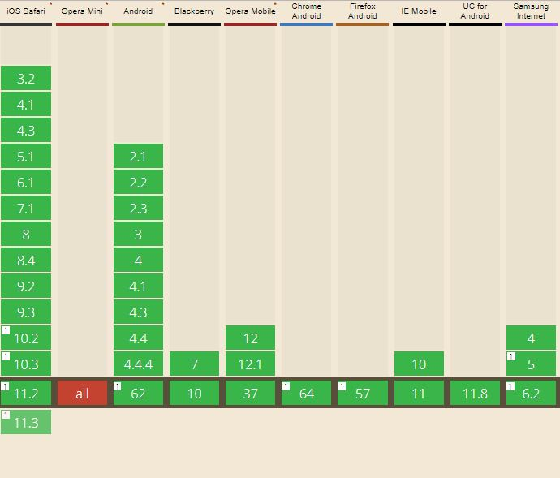</a>
    </td>
  </tr>
  <tr>
    <td align="center" bgcolor="EFEFEF">
      Compatibilité de l'API de géolocalisation sur divers navigateurs mobiles
    </td>
  </tr>
</table>

Nous pouvons alors constater la possibilité d'utiliser cette API sur toutes les versions de tous les navigateurs mobiles courants à l'exception d'Opera Mini. Notons néanmoins que s'il y a un `1` en haut à gauche d'une version, cela signifie que l'API ne peut être utilisée que sur des serveurs sécurisées en https.
Il est toujours bon de vérifier l'existance de l'objet `document.geolocation` avant de l'utiliser :

```html
// Vérifions si le navigateur Web supporte l'API de géolocalisation.
if (navigator.geolocation) {

} else {
  // Si ce n'est pas le cas, on informe l'utilisateur.
  document.write('Your browser does not support GeoLocation');
}
```

#### Exemple avec Google Maps

Le code suivant permet d'utiliser l'API de géolocalisation puis d'afficher la position sur une carte Google Maps grâce à l'API fournie :

```html
<!DOCTYPE html>
<html>
  <head>
    <title>Geolocation</title>
    <meta name="viewport" content="initial-scale=1.0, user-scalable=no">
    <meta charset="utf-8">
    <style>
      /* Always set the map height explicitly to define the size of the div
       * element that contains the map. */
      #map {
        height: 100%;
      }
      /* Optional: Makes the sample page fill the window. */
      html, body {
        height: 100%;
        margin: 0;
        padding: 0;
      }
    </style>
  </head>
  <body>
    <div id="map"></div>
    <script>
      // Note: This example requires that you consent to location sharing when
      // prompted by your browser. If you see the error "The Geolocation service
      // failed.", it means you probably did not give permission for the browser to
      // locate you.
      var map, infoWindow;
      function initMap() {
        map = new google.maps.Map(document.getElementById('map'), {
          center: {lat: -34.397, lng: 150.644},
          zoom: 6
        });
        infoWindow = new google.maps.InfoWindow;

        // Try HTML5 geolocation.
        if (navigator.geolocation) {
          navigator.geolocation.getCurrentPosition(function(position) {
            var pos = {
              lat: position.coords.latitude,
              lng: position.coords.longitude
            };

            infoWindow.setPosition(pos);
            infoWindow.setContent('Location found.');
            infoWindow.open(map);
            map.setCenter(pos);
          }, function() {
            handleLocationError(true, infoWindow, map.getCenter());
          });
        } else {
          // Browser doesn't support Geolocation
          handleLocationError(false, infoWindow, map.getCenter());
        }
      }

      function handleLocationError(browserHasGeolocation, infoWindow, pos) {
        infoWindow.setPosition(pos);
        infoWindow.setContent(browserHasGeolocation ?
                              'Error: The Geolocation service failed.' :
                              'Error: Your browser doesn\'t support geolocation.');
        infoWindow.open(map);
      }
    </script>
    <script async defer
    src="https://maps.googleapis.com/maps/api/js?key=YOUR_API_KEY&callback=initMap">
    </script>
  </body>
</html>
```

La ligne `<script async defer src="https://maps.googleapis.com/maps/api/js?key=YOUR_API_KEY&callback=initMap"></script>` permet d'utiliser l'API Google. Nous pouvons reconnaître le bloc utilisant l'API de géolocalisation :

```html
// Try HTML5 geolocation.
if (navigator.geolocation) {
  navigator.geolocation.getCurrentPosition(function(position) {
    var pos = {
      lat: position.coords.latitude,
      lng: position.coords.longitude
    };

    infoWindow.setPosition(pos);
    infoWindow.setContent('Location found.');
    infoWindow.open(map);
    map.setCenter(pos);
  }, function() {
    handleLocationError(true, infoWindow, map.getCenter());
  });
} else {
  // Browser doesn't support Geolocation
  handleLocationError(false, infoWindow, map.getCenter());
}
```

Si le navigateur supporte l'API de géolocalisation, on envoie les coordonnées de l'utilisateur à `infoWindow`.

## API d'orientation et de mouvement

#### Principe

Il est possible d'accéder aux informations concernant les angles d’orientation du dispositif mobile par une API. Celle-ci permet de détecter les changements de valeurs de divers angles définis sur un smartphone. Il s'agit des angles *alpha*, *beta* et *gamma*. Il sont définis comme suit :

<table align="center" border="0">
  <tr>
    <td>
      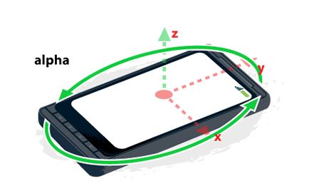
    </td>
  </tr>
  <tr>
    <td align="center" bgcolor="EFEFEF">
      Illustration de l'angle <i>alpha</i> dans le répère de coordonnées d'un smartphone
    </td>
  </tr>
</table>

L'angle *alpha* est la rotation suivant l'axe z. Il vaut 0° lorsque l'appareil est dirigé vers le Nord, et augmente lorsque l'on tourne celui-ci dans le sens anti-horaire.

<table align="center" border="0">
  <tr>
    <td>
      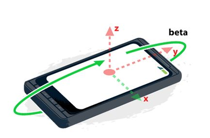
    </td>
  </tr>
  <tr>
    <td align="center" bgcolor="EFEFEF">
      Illustration de l'angle <i>beta</i> dans le répère de coordonnées d'un smartphone
    </td>
  </tr>
</table>

L'angle *beta* est la rotation suivant l'axe x. Il vaut 0° lorsque le haut et le bas de l'appareil sont à équidistance par rapport à la surface de la Terre, et augmente lorsque l'on incline le haut de celui-ci en direction du sol.

<table align="center" border="0">
  <tr>
    <td>
      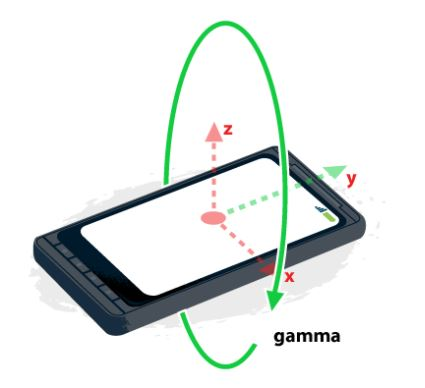
    </td>
  </tr>
  <tr>
    <td align="center" bgcolor="EFEFEF">
      Illustration de l'angle <i>gamma</i> dans le répère de coordonnées d'un smartphone
    </td>
  </tr>
</table>

L'angle *beta* est la rotation suivant l'axe y. Il vaut 0° lorsque les côtés droite et gauche de l'appareil sont à équidistance par rapport à la surface de la Terre, et augmente lorsque l'on incline le côté droit de celui-ci en direction du sol.

Cette API utilise le gyroscope et le compas de l'appareil. L’évènement `deviceorientation` permet de récupérer les valeurs des angles, comme suit :

```html
// Vérfions si le navigateur supporte DeviceOrientationEvent.
if (window.DeviceOrientationEvent) {
  // Création d'un eventListener.
  window.addEventListener('deviceorientation', function(event) {
    // Récupération de l'angle gamma.
    var tiltLR = event.gamma;

    // Récupération de l'angle beta.
    var titleFB = event.beta;

    // Récupération de l'angle alpha.
    var direction = event.alpha;
  });
}
```

Ici, on ajoute un eventListener à l'objet `window` permettant de détecter les changements sur l'évènement `deviceorientation`. Lorsque une valeur relative à cet évènement change, on peut accéder à ses informations via la fonction de callback. Celle-ci donne accès à une variable, ici `event`, par laquelle on peut accéder aux valeurs des angles *alpha*, *beta* et *gamma*.

L'API de mouvement utilise l’accéléromètre de la machine, pour détecter les mouvements de celle-ci selon le répère X, Y, Z, défini comme suit :

<table align="center" border="0">
  <tr>
    <td>
      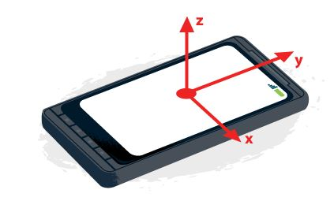
    </td>
  </tr>
  <tr>
    <td align="center" bgcolor="EFEFEF">
      Illustration du répère cartésien du smartphone
    </td>
  </tr>
</table>

 L’évènement `devicemotion` est utilisé pour récupérer les informations relatives à un changement dans les valeurs d'accélération suivant les axes du répère.

 ```html
if(window.DeviceMotionEvent) {
  window.addEventListener("devicemotion", process, false);
} else {
  // Le navigateur ne supporte pas l'événement devicemotion
}

function process(event) {
  var x = event.accelerationIncludingGravity.x;
  var y = event.accelerationIncludingGravity.y;
  var z = event.accelerationIncludingGravity.z;

  // Faisons quelque chose de génial !
}
```

L'objet `event` renvoie plusieurs propriétés comme par exemple ici `accelerationIncludingGravity` renvoyant la valeur de l'accélération brute, retournée par l'accéléromètre. Il y a aussi les propriétés `acceleration`, renvoyant l'accélération calculée par l'appareil en enlevant la gravité, ou encore `rotationRate`, renvoyant les taux de rotation de l'appareil suivant les trois axes.

#### Compatibilité

L'API d'orientation et de mouvement n'est hélas pas totalement supporté par la plupart des navigateurs comme nous pouvons le voir sur le *caniuse* suivant :

<table align="center" border="0">
  <tr>
    <td>
      <a href="https://caniuse.com/#feat=deviceorientation" target="new">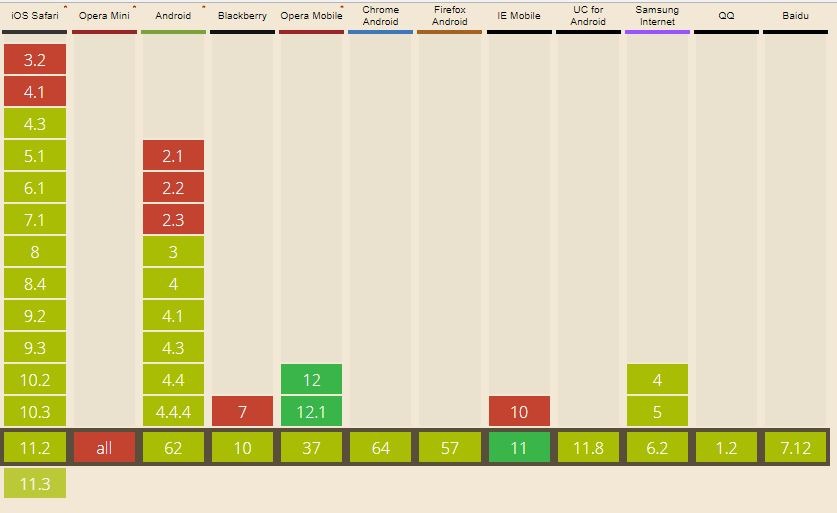</a>
    </td>
  </tr>
  <tr>
    <td align="center" bgcolor="EFEFEF">
      Compatibilité de l'API d'orientation et de mouvement sur divers navigateurs mobiles
    </td>
  </tr>
</table>

Nous constatons alors que pour la quasi-totalité des navigateurs cette API est *partiellement* supportée. Cela veut dire qu'il subsiste des difficultés dans certains cas. Ici, le support partiel est dû à un manque par rapport à l'évènement `compassneedscalibration`, qui est l'un des trois évènements de `DeviceMotionEvent` avec `devicemotion` et `deviceorientation` que nous avons vu précedemment. Ainsi, nous pouvons considérer que cette API est bien supportée pour presque tous les navigateurs.

#### Exemples d'application

De nombreuses applications sont possibles grâce à cette API. En lien avec l'API de géolocalisation, il est possible d'utiliser l'API d'orientation et de mouvement afin de connaître la direction de l'utilisateur ou encore sa vitesse. Cette API peut être utilisée pour mettre à jour des données, lancer des actions suivant le mouvement fait par l'utilisateur avec son smartphone par exemple. Le `devicemotion` est utile aussi pour des utilisations liée à des applications de santé ou de fitness. Elle est aussi utilisable dans le cadre de petits jeux videos. Un exemple d'une telle application est détaillée sur ce [lien](https://developer.mozilla.org/en-US/Apps/Fundamentals/gather_and_modify_data/responding_to_device_orientation_changes). Il s'agit du jeu du *rolling-ball*. En faisant bouger l'appareil, la balle bouge; l'objectif étant de la placer dans le trou.

<table align="center" border="0">
  <tr>
    <td>
      <a href="https://developer.mozilla.org/en-US/Apps/Fundamentals/gather_and_modify_data/responding_to_device_orientation_changes" target="new">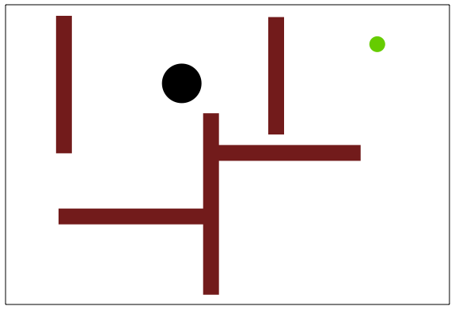</a>
    </td>
  </tr>
  <tr>
    <td align="center" bgcolor="EFEFEF">
      Illustration du jeu <i>rolling-ball</i>
    </td>
  </tr>
</table>

## API de vibration

#### Principe

L'API de vibration permet, comme son nom l'indique, de faire vibrer la machine, d’envoyer un signal non sonore à un utilisateur. L'objet `navigator` possède une fonction `vibrate` permettant de faire vibrer la machine suivant les arguments passés à cette fonction.

```html
// Vibre une fois durant 1s (1000 ms).
navigator.vibrate(1000);

// Vibre "en séquence". Vibre pendant 3s, puis pause pendant 2s et enfin vibre à nouveau pendant 1s.
navigator.vibrate([3000, 2000, 1000]);
```

Il possible d'arrêter une vibration en cours via ces deux méthodes :

```html
navigator.vibrate(0);
navigator.vibrate([]);
```

Il possible d'effectuer des vibrations en continu grâce à l'utilisation de `setInterval`.

```html
var vibrateInterval;

// Starts vibration at passed in level
function startVibrate(duration) {
	navigator.vibrate(duration);
}

// Stops vibration
function stopVibrate() {
	// Clear interval and stop persistent vibrating
	if(vibrateInterval) clearInterval(vibrateInterval);
	navigator.vibrate(0);
}

// Start persistent vibration at given duration and interval
// Assumes a number value is given
function startPeristentVibrate(duration, interval) {
	vibrateInterval = setInterval(function() {
		startVibrate(duration);
	}, interval);
}
```

#### Compatibilité

L'API de vibration est totalement supportée sur la plupart des navigateurs mobiles :

<table align="center" border="0">
  <tr>
    <td>
      <a href="https://caniuse.com/#feat=vibration" target="new">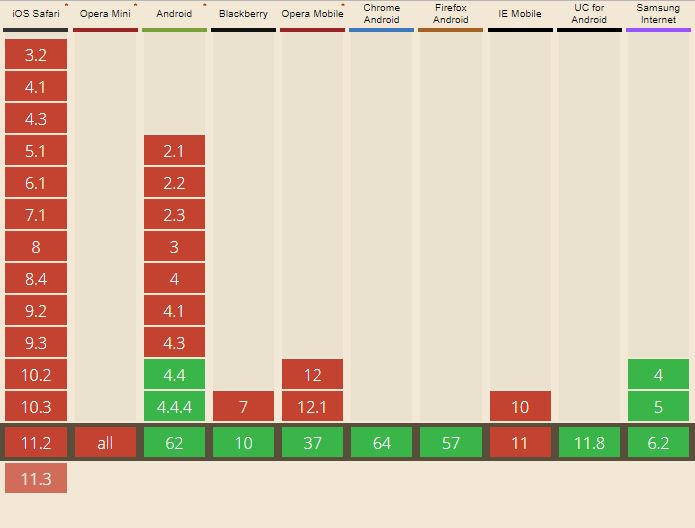</a>
    </td>
  </tr>
  <tr>
    <td align="center" bgcolor="EFEFEF">
      Compatibilité de l'API de vibration sur divers navigateurs mobiles
    </td>
  </tr>
</table>

Seuls les navigateurs iOS Safari, Opera Mini et IE (Internet Explorer) Mobile ne supportent pas cette API. Sur tous les autres navigateurs mobiles, il est possible d'utiliser l'API sans aucun problème.

#### Exemples d'application

Cette API est très utile pour lancer des alertes via cet effet non-sonore qu'est la vibration. Cela peut être particulièrement intéressant dans le cas d'une application de jeu vidéo ou encore dans le cas d'un streaming vidéo. On peut en effet imaginer regarder une vidéo sur un smartphone dans un navigateur mobile et lorsqu'une explosion se produit dans la vidéo, l'effet de vibration pourrait se lancer.

Il est possible d'envoyer des messages en Morse grâce à cette API :

```html
navigator.vibrate([100,30,100,30,100,200,200,30,200,30,200,200,100,30,100,30,100]); // Vibrate 'SOS' in Morse
```

## API Battery Status

#### Principe

L'API Battery Status, souvent mentionnée sous le nom *Battery API*, permet de récupérer des informations sur le niveau de charge d'un dispositif mobile. L'objet `BatteryManager` offre des informations sur le niveau de charge actuel, si la batterie est en train de charger ou pas, etc... On peut accéder à cet objet via `navigator.battery`.

```html
// Niveau de batterie actuel.
navigator.battery.level;

// Statut de charge (boolean), si la batterie est en train de charger ou pas.
navigator.battery.charging;

// Temps avant la recharge totale de la batterie.
navigator.battery.chargingTime;

// Temps avant la décharge totale de la batterie.
navigator.battery.dischargingTime;
```

De plus, l'objet `BatteryManager` donne aussi accès à des évènements permettant de suivre l'évolution de la batterie.

```html
var battery = navigator.battery || navigator.mozBattery || navigator.webkitBattery; //suivant le navigateur les noms peuvent être différents.

function updateBatteryStatus() {
  console.log("Batterie chargée à : " + battery.level * 100 + " %");

  if (battery.charging) {
    console.log("Chargement de la batterie");
  }
}

battery.addEventListener("chargingchange", updateBatteryStatus);
battery.addEventListener("levelchange", updateBatteryStatus);
updateBatteryStatus();
```

Nous avons ici deux évènements : un permettant de savoir si l'appareil a été mis en charge ou pas, via `chargingchange`, et l'autre permettant de détecter les changements de niveau de batterie, `levelchange`.

#### Compatibilité

L'API Battery Status est totalement supportée par la plupart des navigateurs mobiles :

<table align="center" border="0">
  <tr>
    <td>
      <a href="https://caniuse.com/#search=battery" target="new"></a>
    </td>
  </tr>
  <tr>
    <td align="center" bgcolor="EFEFEF">
      Compatibilité de l'API Battery Status sur divers navigateurs mobiles
    </td>
  </tr>
</table>

Les navigateurs ne supportant pas l'API de vibration ne supportent pas non plus l'API Battery Status. Il existe une différence néanmoins : ici le navigateur BlackBerry ne supporte pas cette API. Pour les autres, il est possible de l'utiliser sans aucun problème.

#### Exemple d'application

Il n'y a ici par énormément d'application directe de cette API, si ce n'est de mettre au point des interfaces permettant de visualiser les informations relatives à la batterie.

<table align="center" border="0">
  <tr>
    <td>
      <a href="http://pazguille.github.io/demo-battery-api/" target="new">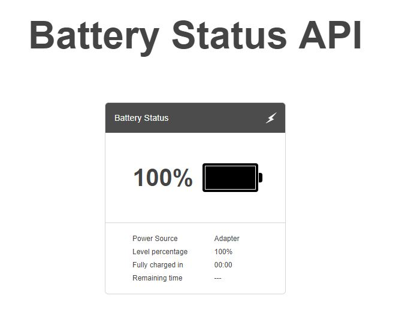</a>
    </td>
  </tr>
  <tr>
    <td align="center" bgcolor="EFEFEF">
      Exemple d'interface utilisant l'API Battery Status
    </td>
  </tr>
</table>

Nous pouvons trouver le code source sur le GitHub suivant : [Battery Status API Demo](https://github.com/pazguille/demo-battery-api). Si nous regardons le code dans `src/index.js`, nous pouvons voir l'utilisation des évènements décrits plus haut :

```html
window.onload = function () {
  battery.addEventListener('chargingchange', function() {
    readBattery();
  });

  battery.addEventListener("levelchange", function() {
    readBattery();
  });
};
```

D'autres exemples similaires peuvent être trouvés, comme par exemple ce [codepen](https://codepen.io/matt-west/pen/vIwra).

## API de lumière ambiante

#### Principe

L'API de lumière ambiante permet d'accéder au capteur d'intensité lumineuse présent dans un appareil. Cette API permet le *switch* rapide entre le mode “jour” et le mode “nuit” suivant la lumière ambiante. L'événement `devicelight` permet d'accéder à ces informations.

```html
window.addEventListener('devicelight', function(event) {
    // Get the ambient light level in lux.
    var lightLevel = event.value;
});
```

La fonction de callback permet ici de récupérer la valeur de l'intensité lumineuse, en lux.

#### Compatibilité

L'API de lumière ambiante n'est encore supportée que par Firefox Mobile pour le moment :

<table align="center" border="0">
  <tr>
    <td>
      <a href="https://caniuse.com/#search=ambient%20light" target="new">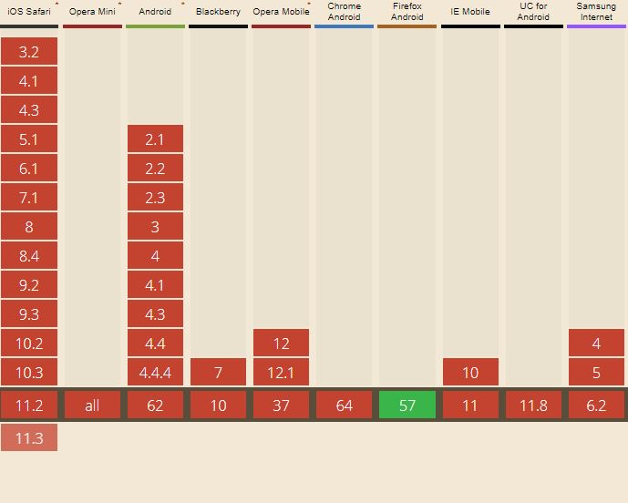</a>
    </td>
  </tr>
  <tr>
    <td align="center" bgcolor="EFEFEF">
      Compatibilité de l'API de lumière ambiante sur divers navigateurs mobiles
    </td>
  </tr>
</table>

Comme nous pouvons le constater, cette API est très peu supportée par les navigateurs actuels. Microsoft est en train d'accélérer par rapport à cela et leurs navigateurs mobiles devraient bientôt la supporter.

#### Exemple

Voici un exemple simple où l'on passe du mode "nuit" au mode "jour" et inversement, selon la valeur de l'intensité lumineuse ambiante.

```html
window.addEventListener('devicelight', function(event) {
  var html = document.getElementsByTagName('html')[0];

  if (event.value < 50) {
    html.classList.add('darklight');
    html.classList.remove('brightlight');
  } else {
    html.classList.add('brightlight');
    html.classList.remove('darklight');
  }
});
```

Si la valeur retournée par l'évènement `devicelight` est inférieur à 50, on passe en mode "nuit", sinon, on est en mode "jour".

## API d'évènements de proximité

#### Principe

L'API d'évènements de proximité utilie des capteurs de proximité, ceux-ci sont généralement disponibles sur les appareils mobile. Les événements de proximité permettent, par exemple, de savoir lorsqu'un utilisateur est près de l'appareil.
Il existe deux types d'évènements de proximité : `DeviceProximityEvent` et `UserProximityEvent`. Le premier est le plus précis : il donne la distance entre un objet et le capteur de l'appareil. Le second est bien moins précis puisqu'il donne seulement un booléen `near`, nous indiquant si un user est proche ou non de l'appareil.

```html
// DeviceProximityEvent
window.addEventListener('deviceproximity', function(event) {
    // La distance maximale couverte par le capteur (en cm).
    var max = event.max;

    // La distance minimale couverte par le capteur (en cm).
    var min = event.min;

    // La proximité de l'appareil.
    var proximity = event.value;
});

// UserProximityEvent.
window.addEventListener('userproximity', function(event) {
    if (event.near) {
        // Do something.
    } else {
        // Do something else.
    }
});
```

#### Compatibilité

Comme l'API de lumière ambiante, l'API d'évènements de proximité est encore en phase de développement sur la plupart des navigateurs. Seul Firefox la supporte pour le moment :

<table align="center" border="0">
  <tr>
    <td>
      <a href="https://caniuse.com/#feat=proximity" target="new">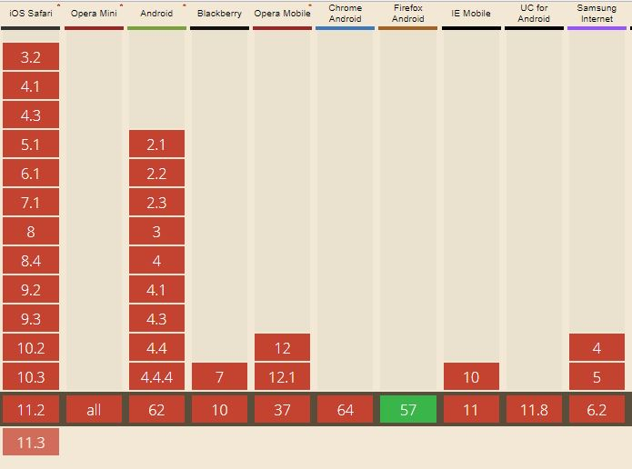</a>
    </td>
  </tr>
  <tr>
    <td align="center" bgcolor="EFEFEF">
      Compatibilité de l'API d'évènements de proximité sur divers navigateurs mobiles
    </td>
  </tr>
</table>

#### Exemple

Une application simple de cette API est son utilisation au cours d'un appel téléphoniques : lorsqu'un utilisateur est en train de passer un appel téléphonique et que l'appareil est près de l'oreille, il est possible de l'utiliser pour éteindre l'écran.

```html
window.addEventListener('userproximity', function(event) {
  if (event.near) {
    // extinction de l'écran
    navigator.mozPower.screenEnabled = false;
  } else {
    // allumage de l'écran
    navigator.mozPower.screenEnabled = true;
  }
});
```

## API de capture média

#### Principe

L'API de capture média permet d’accéder à la caméra du mobile. La fonction `getUserMedia` permet de l’utiliser, et même de créer des streams vidéos.

```html
// Utilisation de la caméra.
navigator.getUserMedia(
    // Le premier argument de la fonction est un objet avec les options voulues.
    {
        video: true
    },
    // Fonction de callback, si l'appel est un succès.
    function(localMediaStream) {
        var vid = document.getElementById('camera-stream');

        // Création d'un objet URL pour le vidéo stream.
        vid.src = window.URL.createObjectURL(localMediaStream);
    },
    // Fonction de callback d'erreur.
    function(err) {
        console.log('The following error occurred when trying to use getUserMedia: ' + err);
    }
);
```

Dans la fonction de callback de succès, on peut accéder aux données renvoyées par la caméra via la variable `localMediaStream`.

#### Compatibilité

Compte tenu de la popularité de l'utilisation de la caméra des appareils mobiles, la plupart des navigateurs supporte cette API :

<table align="center" border="0">
  <tr>
    <td>
      <a href="https://caniuse.com/#feat=stream" target="new">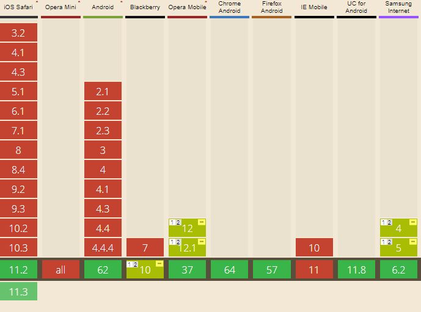</a>
    </td>
  </tr>
  <tr>
    <td align="center" bgcolor="EFEFEF">
      Compatibilité de l'API de capture média sur divers navigateurs mobiles
    </td>
  </tr>
</table>

Notons le support partiel de cette API sur BlackBerry : cela est dû à une utilisation de l'ancienne spécification de l'API.

Afin de vérifier le support d'un navigateur, ne pas oublier d'ajouter un test dans le code :

```html
if (navigator.getUserMedia) {
  //Le code vu dans la partie "Principe"
} else {
  alert('Sorry, your browser does not support getUserMedia');
}
```

Comme pour toutes les API vues dans cette veille, il existe des préfixes différents pour les fonctions concernées. Par exemple, ici, il esrt recommandé d'ajouter le code suivant :

```html
window.onload = function() {

  // Normalize the various vendor prefixed versions of getUserMedia.
  navigator.getUserMedia = (navigator.getUserMedia ||
                            navigator.webkitGetUserMedia ||
                            navigator.mozGetUserMedia ||
                            navigator.msGetUserMedia);

}
```

#### Exemple

Comme nous l'avons évoqué en introduction, HMTL5 ajoute les balises `video` et `audio`. Ici, nous allons utiliser la balise `video` pour visualiser un stream vidéo. Reprenons le script JavaScript que nous avons mis en place dans les parties précédentes :

```html
window.onload = function() {

  // Normalize the various vendor prefixed versions of getUserMedia.
  navigator.getUserMedia = (navigator.getUserMedia ||
                            navigator.webkitGetUserMedia ||
                            navigator.mozGetUserMedia ||
                            navigator.msGetUserMedia);

  if (navigator.getUserMedia) {
    // Utilisation de la caméra.
    navigator.getUserMedia(
        // Le premier argument de la fonction est un objet avec les options voulues.
        {
            video: true
        },
        // Fonction de callback, si l'appel est un succès.
        function(localMediaStream) {
            var vid = document.getElementById('camera-stream');

            // Création d'un objet URL pour le vidéo stream.
            vid.src = window.URL.createObjectURL(localMediaStream);
        },
        // Fonction de callback d'erreur.
        function(err) {
            console.log('The following error occurred when trying to use getUserMedia: ' + err);
        }
    );
  } else {
    alert('Sorry, your browser does not support getUserMedia');
  }

}
```

Mettons ce script dans un fichier `script.js`, puis créons un fichier `index.html` avec le code suivant :

```html
<!DOCTYPE html>
<html lang="en">
<head>
  <meta charset="utf-8">
  <title>HTML5 Demo: getUserMedia (Treehouse Blog)</title>
  <link rel="stylesheet" href="style.css">
</head>
<body>
  <div id="video-container">
    <video id="camera-stream" width="500" autoplay></video>
  </div>
  <script src="script.js"></script>
</body>
</html>
```

Puis créons un fichier pour le style CSS, `style.css` :

```html
body {
  background: #F7F7F7;
  margin: 0;
  padding: 0;
}

#video-container {
  margin: 2em auto 0;
  width: 500px;
  padding: 2em;
  background: white;
  -webkit-box-shadow: 0 1px 10px #D9D9D9;
  -moz-box-shadow: 0 1px 10px #D9D9D9;
  -ms-box-shadow: 0 1px 10px #D9D9D9;
  -o-box-shadow: 0 1px 10px #D9D9D9;
  box-shadow: 0 1px 10px #D9D9D9;
}
```

`script.js` va se connecter à la caméra du device à l'ouverture de la page HTML. Et hop, j'apparaîs sur l'écran du navigateur !

<table align="center" border="0">
  <tr>
    <td>
      
    </td>
  </tr>
  <tr>
    <td align="center" bgcolor="EFEFEF">
      Exemple d'utilisation de l'API de capture média
    </td>
  </tr>
</table>

Vous pouvez tester le streaming en appuyant sur le bouton ci-dessous :


<head>
  <meta charset="utf-8">
  <title>HTML5 Demo: getUserMedia (Treehouse Blog)</title>
  <link rel="stylesheet" href="style.css">
</head>
<body>  
  <div id="video-container">
    <video id="camera-stream" width="500" autoplay></video>
    <button onclick="videoStream()">Test video stream !</button>
  </div>
  <script>
  var videoStream = function() {

    // Normalize the various vendor prefixed versions of getUserMedia.
    navigator.getUserMedia = (navigator.getUserMedia ||
                              navigator.webkitGetUserMedia ||
                              navigator.mozGetUserMedia ||
                              navigator.msGetUserMedia);

    if (navigator.getUserMedia) {
      // Utilisation de la caméra.
      navigator.getUserMedia(
          // Le premier argument de la fonction est un objet avec les options voulues.
          {
              video: true
          },
          // Fonction de callback, si l'appel est un succès.
          function(localMediaStream) {
              var vid = document.getElementById('camera-stream');

              // Création d'un objet URL pour le vidéo stream.
              vid.src = window.URL.createObjectURL(localMediaStream);
          },
          // Fonction de callback d'erreur.
          function(err) {
              console.log('The following error occurred when trying to use getUserMedia: ' + err);
          }
      );
    } else {
      alert('Sorry, your browser does not support getUserMedia');
    }

  }
  </script>
</body>

CSS3 donne accès à des filtres : nous pouvons ajouter cette ligne de code au fichier `style.css`.

```html
#camera-stream {
  -webkit-filter: sepia(1);
}
```
 D'autres filtres sont disponibles :

 ```html
-webkit-filter: blur(3px);
-webkit-filter: grayscale(1);
-webkit-filter: sepia(1);
-webkit-filter: brightness(2.5);
-webkit-filter: contrast(5);
-webkit-filter: hue-rotate(125deg);
-webkit-filter: invert(1);
-webkit-filter: saturate(3);
-webkit-filter: opacity(0.3);
```
